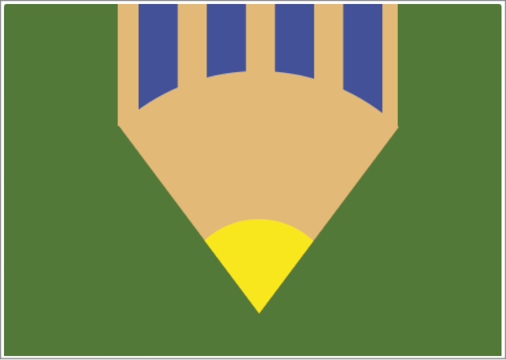
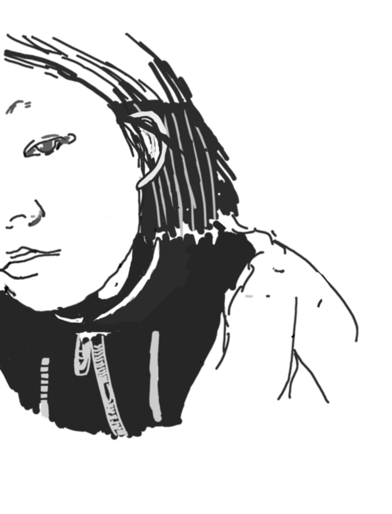
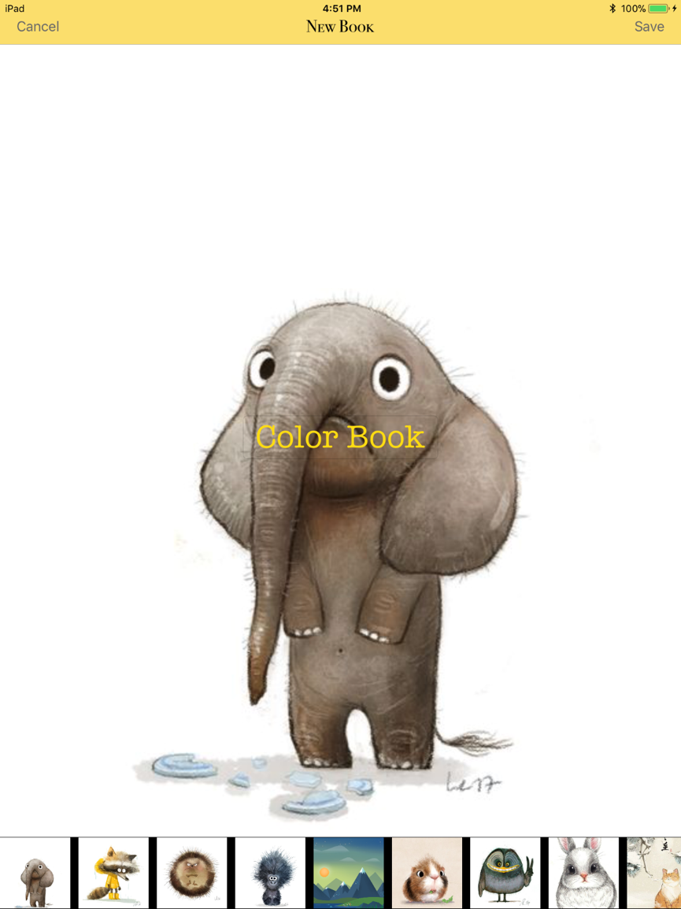
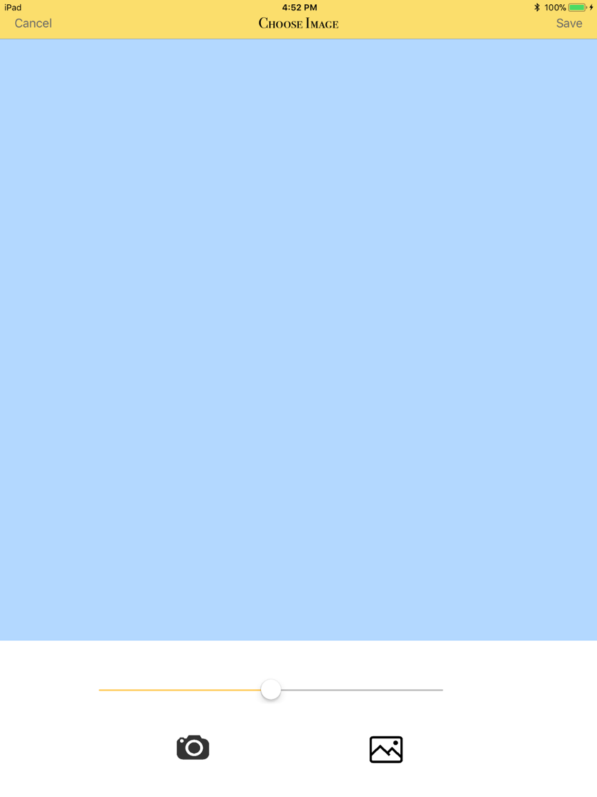
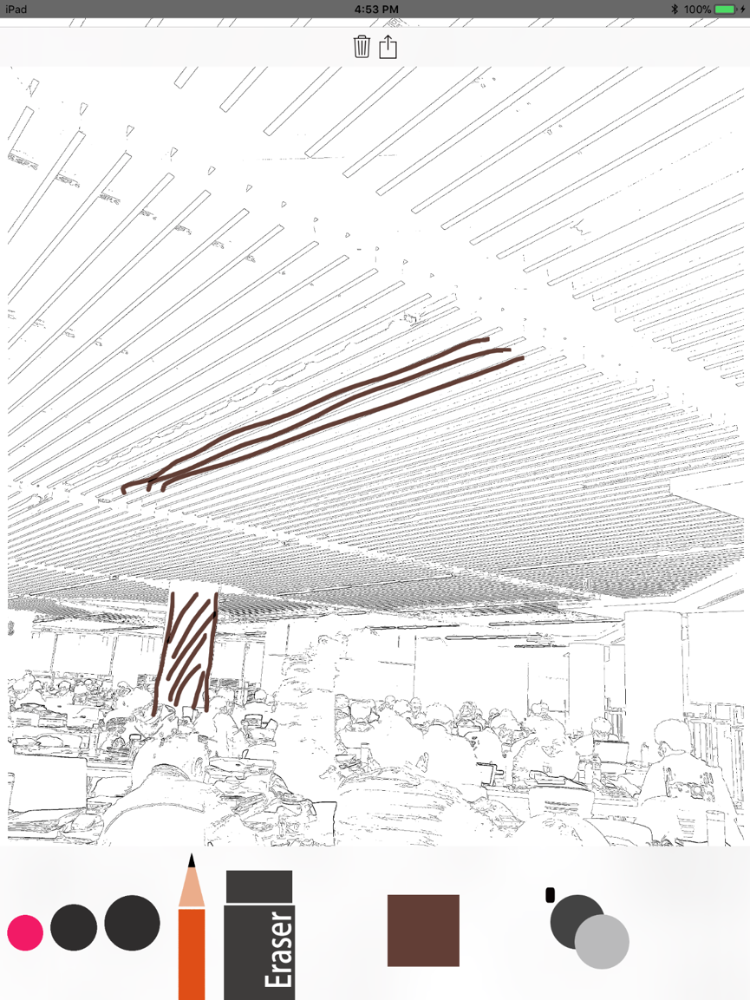

# 涂书 ColorBook

##### CN

这是一款移动端app, 您也许涂过《秘密花园》，为自己创造的艺术而惊艳；您也许曾想过想画其他图案，如美丽的建筑物、人像... 但又不知所措该从何画起。

那么我们的APP就是为你设计的！如果你想画一个建筑物，你可以到网上照一张这个建筑物的照片或者自己拍一张，我们会把它转变成线条图，接下来你就可以创作属于自己的作品了~

我们的应用至少需要您有iOS 9.0系统，未来我们考虑使用React native进行开发，使平台覆盖得更广！

##### EN

This is a mobile app. 

You might have enjoyed creating your own art works when painting on the book "Secret Garden" which is prevailing several years ago; you might as well feel at a loss when you want draw something like: a wonderful architecture, a portait, etc. 

Then, this app is designed for you! When you when to draw an architecture, just find a picture of it on web or take a photo yourself, then we will transfer it to edges/lines, then you can create your personal art work!

Currently, our app supports iOS platform, but we are planning to recreate it using React Native. 

## Platform

iOS 9.0 

iPad & iPhone

## Some Interfaces

##### This is from a painting novice who wants to learn painting...

##### 来自一个不会画画但想画画的同学...

##### New a book/新建画册

##### Choose Image or take a photo

##### Transferring result/转换线条结果

##### Draw/绘画

